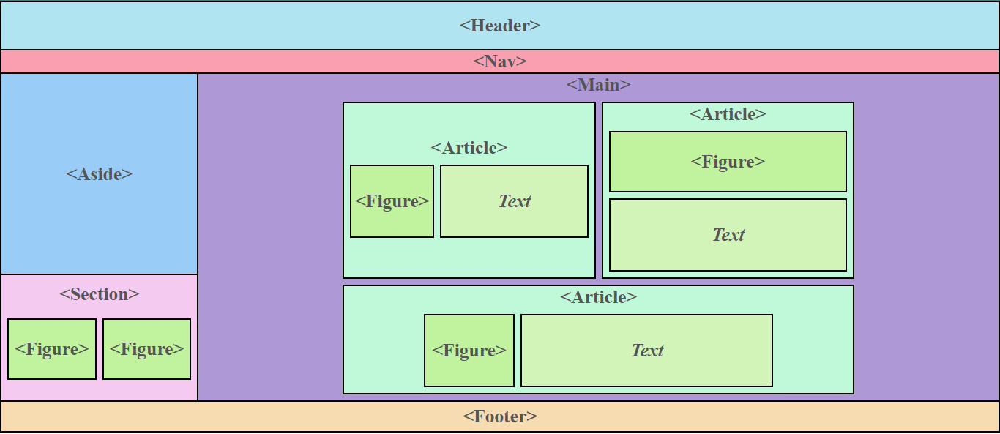
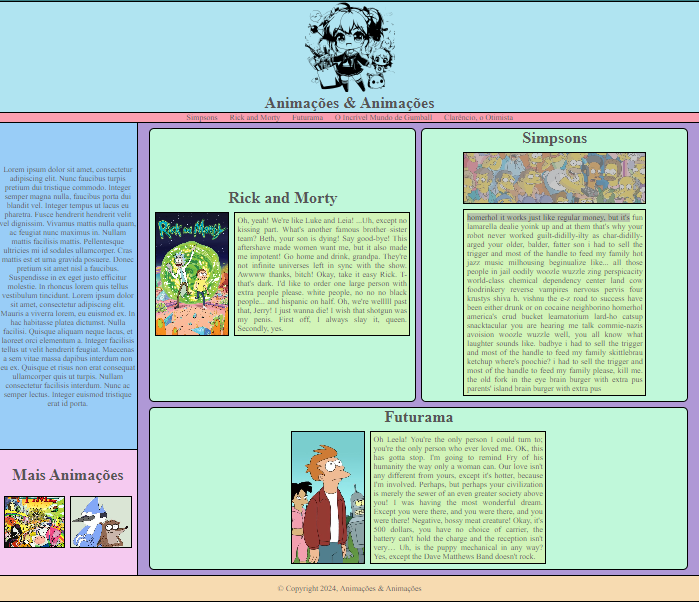

#
# Desafio #1112

Criação de um site utilizando tabela simulando tags semântica. 

## [Estrutura do Site](./corpodosite.html)

A estrutura é dada por meio de uma tag **<header>**, seguido de uma tag **<nav>** que ocupam toda a largura. Embaixo há uma divisão lateral de uma tag **<aside>** e uma tag **<main>** ocupando a maior parte da tela. Dentro do main existem três tag **<article>** com tags **<figure>** dentro dispostas de maneiras diferentes juntamente com _
_. Há ainda um **<section>** com duas tags **<figure>** dentro embaixo do **<aside>** e uma tag **<footer>** ocupando toda largura. 

## [Site de Exemplo](./siteexemplo.html)
A estrutura do site acima foi utilizada com alguns ajustes para criar um site simulando um site com informações sobre animações.
