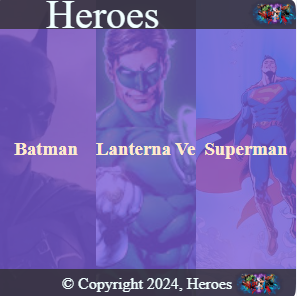
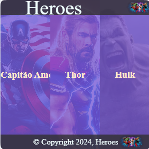
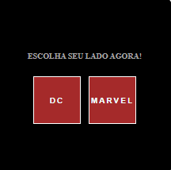

# Desafio 1314 - Divs e Responsividade(@media)

Criação de página de imagens de heróis utilizando html+css+javascript. 
Com duas sections com imagens de herois de animação:

  

## Estrutura HTML (Header, Main, Sections, Divs e Footer)
Existe uma tag **&lt;header&gt;** com uma **&lt;div&gt;** class _.logo_ e uma **&lt;div&gt;** class _.header_. Embaixo a **&lt;main&gt;** possui uma **&lt;div&gt;** e duas **&lt;section&gt;** 's , a **&lt;div&gt;** com id _#main-content_ como container para o conteudo principal inicial da pagina, com um **&lt;div&gt;** com class _.btns_ como container para os botões. As duas  **&lt;section&gt;** com id _#dc_ e _#marvel_ servem como container para guardar as imagens, possuindo 3 **&lt;div&gt;** 's dentro com class _.heroi_ e ._(nomedoid)-heroi_ servindo de container para uma imagem. No **&lt;footer&gt;** tem uma **&lt;div&gt;** com class _.footer_ e _.logo_. 

## Responsividade (@media)
No codigo CSS há 6 _@media_, 3 definidos pela largura:  tela com largura até 400px, tela com largura até 480px e tela com largura até 768px, e três para altura : telas com altura até 500px,400px e uma para telas com largura ou altura até 238px.

## Responsividade

### Header e Footer
Em tamanhos de tela menores que 238px o header e footer não é exibido, afim de preservar apenas o contéudo principal com total visibilidade. Nos tamanhos acima seu tamanho é ajustado. 

  

### Section 
O _@media_ não altera o comportamento das **&lt;section&gt;**'s, que é sempre sendo exibido seu contéudo na pagina inteira. 
